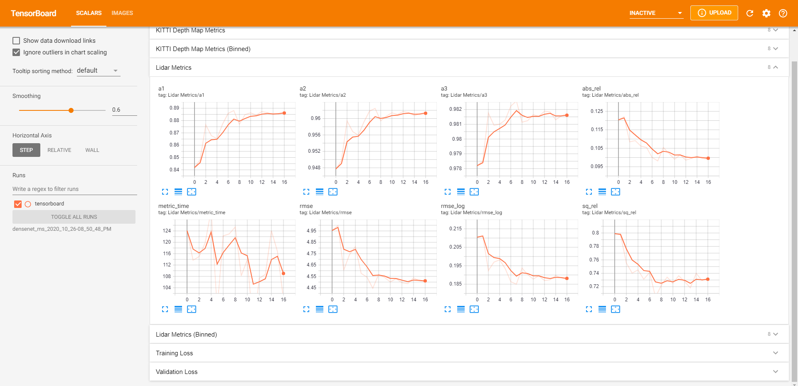
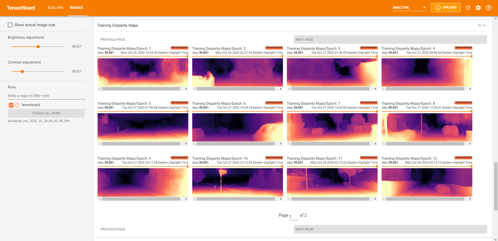
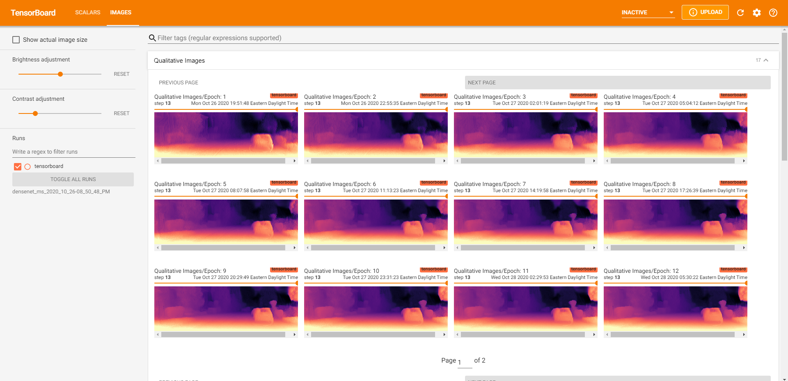

# Dense Depth Summer Research (DDSR2020)
In this repository, we replicate the research of [Monodepth2 - Digging into Self-Supervised Monocular Depth Prediction (ICCV 2019)](https://arxiv.org/abs/1806.01260). Additionally, we explore a few extensions to this research and find that replacing the original residual neural network (ResNet) encoder with a densely connected convoluational network (DenseNet) encoder results in better metrics and faster model covergence. We observe that for similar levels of accuracy in dense depth - the DenseNet architecture is more efficient in number of learned parameters and computation at the trade-off of memory usage during training.

<p align="center">
  <br>
  <i>An example scene from the KITTI dataset.</i><br>
  <i>Top: Original input image, Middle: Baseline Monodepth2 (ResNet18), Bottom: DenseNet121 Result.</i>
</p>

## Metrics & Pre-Trained Model Checkpoints
KITTI Eigen Dataset (lidar ground truth)
| Model Name | abs_rel | sq_rel | rmse | rmse_log | a1 | a2 | a3 | 
|------------|---------|--------|------|----------|----|----|----|
| [Baseline (M)](https://drive.google.com/file/d/1i7KLIYCceUlVi1nnKs9PSTjQ09Xepnlw/view?usp=sharing) | 0.119 | 0.935 | 4.938 | 0.196 | 0.868 | 0.958 | 0.981 |
| [DenseNet (M)](https://drive.google.com/file/d/1cLtV5i3m-cq8YVlEG6dVZKGfA0KyRwz0/view?usp=sharing) | **0.107** | **0.794** | **4.564** | **0.182** | **0.89** | **0.965** | **0.983** |

| Model Name | abs_rel | sq_rel | rmse | rmse_log | a1 | a2 | a3 | 
|------------|---------|--------|------|----------|----|----|----|
| [Baseline (S)](https://drive.google.com/file/d/1JptfHY04aG08l4SLUyMsr5zowvtMQtzB/view?usp=sharing) | 0.108 | 0.832 | 4.858 | 0.202 | 0.866 | 0.952 | 0.977 |
| [DenseNet (S)](https://drive.google.com/file/d/1tVK2jgbZd5g5eBFJm5IAEUAODn6Esr0r/view?usp=sharing) | **0.103** | **0.807** | **4.803** | **0.199** | **0.876** | **0.954** | **0.978** |

| Model Name | abs_rel | sq_rel | rmse | rmse_log | a1 | a2 | a3 | 
|------------|---------|--------|------|----------|----|----|----|
| [Baseline (MS)](https://drive.google.com/file/d/1yqVocIQMeDeyJahxz-W7dg756-UG26VR/view?usp=sharing) | 0.103 | 0.793 | 4.69 | 0.19 | 0.878 | 0.96 | 0.981 |
| [DenseNet (MS)](https://drive.google.com/file/d/15htyrNsY7mUPQJUq_E4krgwC6D6URUvx/view?usp=sharing) | **0.098** | **0.705** | **4.445** | **0.185** | **0.888** | **0.962** | **0.982** |

Note: All models were trained with an image resolution of 1024 x 320. Full metrics spreadsheet can be found [here](https://docs.google.com/spreadsheets/d/1n6piQkH8gNGJJ9agPPDEiB042ysAiTRlJfZc2307QT0/edit?usp=sharing)

## Qualitative Evaluation
Some qualitative results comparing Monodepth2 ResNet18 vs. DenseNet121 models side-by-side from manually-curated KITTI scenes. Mono, Stereo, and Mono + Stereo are grouped together for easy side-by-side comparison.
<p align="center">
  <br>
</p>

## Tensorboard Visualizations

Our tensorboard visualizations allow for intuitive debugging. We are able to quickly sanity check results by visualizing the predicted depth map, forward / backward / stereo reprojections, automasks, and losses.
<p align="center">
  <br>
</p>

We display training / validation loss metrics and validation metrics to allow you to quickly monitor your training jobs.
<p align="center">
  
  <br>
</p>

Additionally, we save the depth map results from each epoch to allow you to quickly visualize how the model has changed over time across our manually curated dataset. This also enables easy model comparison afterwards (example above). 
<p align="center">
  
  <br>
</p>

## Environment setup
1. [Install](https://docs.conda.io/projects/conda/en/latest/user-guide/install/) Anaconda. You can install Miniconda if space is limited.
2. Create your `ddsr` anaconda environment where you will be doing development. In terminal:
```
$ conda env create -f ddsr_environment.yml
```
3. Activate `ddsr` anaconda environment:
```
$ conda activate ddsr
```
4. Create a Jupyter kernel for your `ddsr` anaconda environment.
```
$ python -m ipykernel install --user --name ddsr --display-name "Python (ddsr)"
```

## Testing your environment
1. Launch jupyter and ensure you can run the import statements.
```
$ jupyter notebook
```

## Introducing new packages and dependencies into ddsr_environment.yml
1. While on your ddsr environment
```
conda env export --no-builds > ddsr_environment.yml
```

## Contributing Team 
Everything done above was accomplished over the span of a few months from a few high school rising seniors and incoming undergraduate freshmen. 
- Quinn Z Shen (Mentor)
- Alex Jiang
- Aaron Marmolejos
- Kevin Z Shen
- Evan Wang
