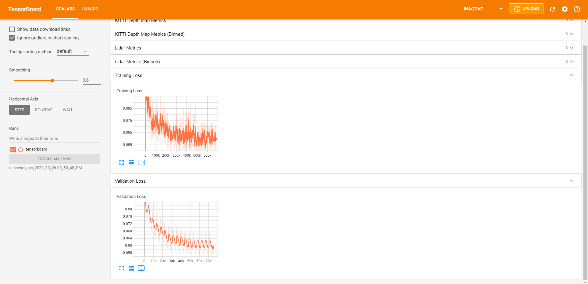

# Dense Depth Summer Research (DDSR2020)
In this repository, we replicate the research of [Monodepth2 - Digging into Self-Supervised Monocular Depth Prediction (ICCV 2019)](https://arxiv.org/abs/1806.01260). Additionally, we explore a few extensions to this research and find that replacing the original residual neural network (ResNet) encoder with a densely connected convoluational network (DenseNet) encoder results in better metrics and faster model covergence. We observe that for similar levels of accuracy in dense depth - the DenseNet architecture is more efficient in number of learned parameters and computation at the trade-off of memory usage during training.

<p align="center">
  <br>
  <i>An example scene from the KITTI dataset.</i><br>
  <i>Top: Original input image, Middle: Baseline Monodepth2 (ResNet18), Bottom: DenseNet121 Result.</i>
</p>

## Metrics & Pre-Trained Model Checkpoints
KITTI Eigen Dataset (LiDAR ground truth)
| Model Name | abs_rel | sq_rel | rmse | rmse_log | a1 | a2 | a3 | 
|------------|---------|--------|------|----------|----|----|----|
| [Baseline (M)](https://drive.google.com/file/d/1i7KLIYCceUlVi1nnKs9PSTjQ09Xepnlw/view?usp=sharing) | 0.119 | 0.935 | 4.938 | 0.196 | 0.868 | 0.958 | 0.981 |
| [DenseNet (M)](https://drive.google.com/file/d/1cLtV5i3m-cq8YVlEG6dVZKGfA0KyRwz0/view?usp=sharing) | **0.107** | **0.794** | **4.564** | **0.182** | **0.89** | **0.965** | **0.983** |

| Model Name | abs_rel | sq_rel | rmse | rmse_log | a1 | a2 | a3 | 
|------------|---------|--------|------|----------|----|----|----|
| [Baseline (S)](https://drive.google.com/file/d/1JptfHY04aG08l4SLUyMsr5zowvtMQtzB/view?usp=sharing) | 0.108 | 0.832 | 4.858 | 0.202 | 0.866 | 0.952 | 0.977 |
| [DenseNet (S)](https://drive.google.com/file/d/1tVK2jgbZd5g5eBFJm5IAEUAODn6Esr0r/view?usp=sharing) | **0.103** | **0.807** | **4.803** | **0.199** | **0.876** | **0.954** | **0.978** |

| Model Name | abs_rel | sq_rel | rmse | rmse_log | a1 | a2 | a3 | 
|------------|---------|--------|------|----------|----|----|----|
| [Baseline (MS)](https://drive.google.com/file/d/1yqVocIQMeDeyJahxz-W7dg756-UG26VR/view?usp=sharing) | 0.103 | 0.793 | 4.69 | 0.19 | 0.878 | 0.96 | 0.981 |
| [DenseNet (MS)](https://drive.google.com/file/d/15htyrNsY7mUPQJUq_E4krgwC6D6URUvx/view?usp=sharing) | **0.098** | **0.705** | **4.445** | **0.185** | **0.888** | **0.962** | **0.982** |

Note: All models were trained with an image resolution of 1024 x 320. Full metrics spreadsheet can be found [here](https://docs.google.com/spreadsheets/d/1n6piQkH8gNGJJ9agPPDEiB042ysAiTRlJfZc2307QT0/edit?usp=sharing)

Memory Usage & Inference Speed
|     | ResNet18 (MS) | DenseNet121 (MS) |
|-----|:----------:|:-------------:|
| Reserved Memory | 1.79GB | 2.52GB |
| Avg. Inference Speed | 11.0ms | 45.4ms |

Note: Inference speed was measured on a GTX 1050 Ti GPU on 1024 x 320 images ([full metrics](https://docs.google.com/spreadsheets/d/1qYgBAbnQs2jYS19vuOMX9rrDQePsgXYQ-6nCUK8M098/edit?usp=sharing)).

## Qualitative Evaluation
Some qualitative results comparing Monodepth2 ResNet18 vs. DenseNet121 models side-by-side from manually-curated KITTI scenes. Mono, Stereo, and Mono + Stereo are grouped together for easy side-by-side comparison.
<p align="center">
  <br>
</p>

## Tensorboard Visualizations

Our tensorboard visualizations allow for intuitive debugging. We are able to quickly sanity check results by visualizing the predicted depth map, forward / backward / stereo reprojections, automasks, and losses.
<p align="center">
  <br>
</p>

We display training / validation loss metrics and validation metrics to allow you to quickly monitor your training jobs.
<p align="center">
  
  <br>
</p>

Additionally, we save the depth map results from each epoch to allow you to quickly visualize how the model has changed over time across our manually curated dataset. This also enables easy model comparison afterwards (example above). 
<p align="center">
  
  <br>
</p>

## Environment setup
1. [Install](https://docs.conda.io/projects/conda/en/latest/user-guide/install/) Anaconda. You can install Miniconda if space is limited.
2. Create your `ddsr` anaconda environment where you will be doing development. In terminal:
```
$ conda env create -f ddsr_environment.yml
```
3. Activate `ddsr` anaconda environment:
```
$ conda activate ddsr
```
4. Install pytorch (find the specific command to run here: https://pytorch.org/)
```
$ conda install pytorch...
```

## Downloading data 
1. Download the KITTI dataset with the following command: (Warning: this takes up around 175 GB)
```
wget -i splits/kitti_dataset_download.txt -P data/kitti_data/
```
2. Unzip with 
```
cd kitti_data
unzip "*.zip"
```
3.  Convert the png images to jpeg (OPTIONAL — speeds up training time)
```
find kitti_data/ -name '*.png' | parallel 'convert -quality 92 -sampling-factor 2x2,1x1,1x1 {.}.png {.}.jpg && rm {}'
```
4. Download the KITTI ground truth depth maps (Warning: this takes up around 14 GB)
```
wget -i splits/kitti_depth_maps_download.txt -P data/kitti_gt/
```
5. Unzip with
```
cd kitti_gt
unzip "*.zip"
```

## Preparing evaluation data :chart_with_upwards_trend:
Note: If you plan to run metrics while training, this must be done before training
1. Export LiDAR ground truth depth with:
```
python export_gt_depth.py --split_path splits/eigen_test.txt --gt_depth_dir data/kitti_data --output_dir data/kitti_gt --use_lidar True
```
2. Export KITTI ground truth depth maps with
```
python export_gt_depth.py --split_path splits/eigen_benchmark_test.txt --gt_depth_dir data/kitti_gt/data_depth_annotated --output_dir data/kitti_gt
```

## Training from scratch
1. Select an existing config from the ```configs``` folder OR Create a config with the following format:
```
num_epochs: [int, number of epochs that the model will train for]
learning_rate: [int, the learning rate]
scheduler_step_size: [int, learning rate scheduler step size]
weight_decay: [int, weight decay factor for learning rate scheduler]
batch_size: [int, batch size]
num_workers: [int, number of workers for multi-process data loading]
use_monocular: [boolean, specifies whether or not to use monocular data]
use_stereo: [boolean, specifies whether or not to use stereo data]
min_depth: [float, minimum bound for depth predictions]
max_depth: [float, maximum bound for depth predictions]
num_scales: [int, number of scales used for multiscalar loss]
tensorboard_step: [int, step size for logging images to tensorboard]
metrics: [boolean, specifies whether or not to calculate metrics while training]
log_dir: [string, path to directory where results will be logged]
gt_dir: [string, path to directory containing ground truth depth data]

depth_network:
  layers: [int, Resnet - 18 or 50; Densenet - 121, 169, 201, or 161)]
  densenet: [boolean, specifies whether to use a densenet encoder; default is resnet]
  fpn: [boolean, specifies whether or ont to use a feature pyramid network]
  pretrained: [boolean, specifies whether or not to use weights pretrained on imageNet]

pose_network: (section not needed for stereo only models)
  layers: [int, Resnet - 18, 50; Densenet - 121, 169, 201, 161)]
  densenet: [boolean, specifies whether to use a densenet encoder; default is resnet]
  pretrained: [boolean, specifies whether or not to use weights pretrained on imageNet]

image:
  width: [int, width of image]
  height: [int, height of image]
  color: [string, color model used during training (RGB/HSV)]

dataset_config_paths:
  train: [string, path to training dataset config]
  val: [string, path to validation dataset config]
  test_lidar: [string, path to testing dataset config (ground truth from LiDAR points)]
  test_gt_map: [string, path to testing dataset config (ground truth from KITTI dataset depth maps)]
  qual: [Optional -- string, path to qualitative dataset config]
  gif: [Optional -- string, path to gif dataset config]
```

2. Train with
```
python trainer.py --config_path [path to training config]
```

## Training from an existing checkpoint
1. Locate an existing experiment folder 
2. Train with 
```
python trainer.py --config_path [path to training config within an experiment folder] --epoch [epoch to continue training from]
```
Note: "--epoch 1" will load the weights from the first checkpoint and begin training from epoch 2

## Evaluation
1. Evaluate metrics on LiDAR data with
```
python monodepth_metrics.py --exp_dir [path to experiment directory] --epoch [epoch/checkpoint number] --use_lidar
```

2. Evaluate metrics on KITTI ground truth depth maps with
```
python monodepth_metrics.py --exp_dir [path to experiment directory] --epoch [epoch/checkpoint number]
```
<p>
</p>
Note: Replace --epoch with --all_epochs to evaluate metrics on ALL checkpoints in specified experiment directory

## Contributing Team :heart:
Everything done above was accomplished over the span of a few months from a few high school rising seniors :school_satchel: and incoming undergraduate freshmen :mortar_board:. As a mentor, I've been inspired by what these students were able to do, completely virtual, during these pandemic times. You rock! Special shoutout to Alex Jiang and Evan Wang for really making this repository your own. 
- Quinn Z Shen (Mentor)
- Alex Jiang
- Aaron Marmolejos
- Kevin Z Shen
- Evan Wang